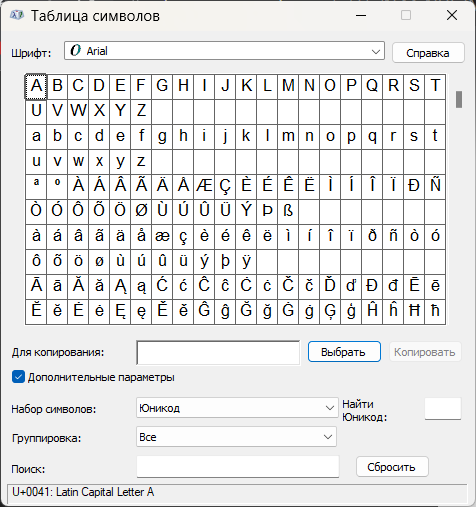
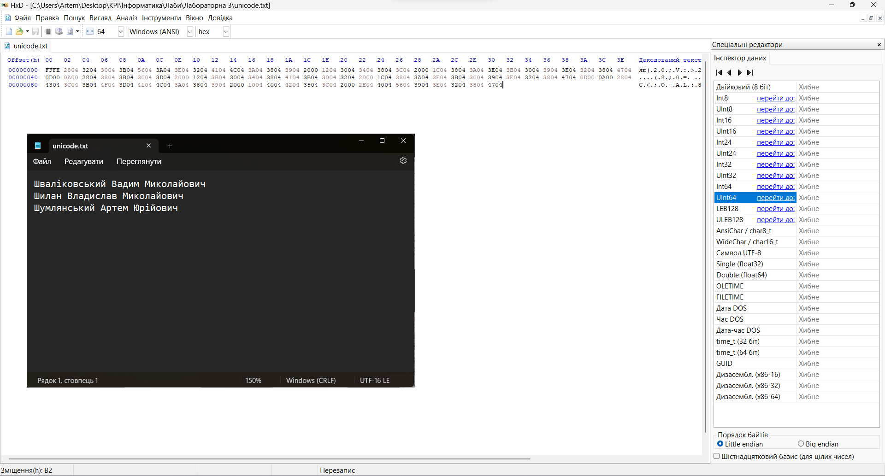
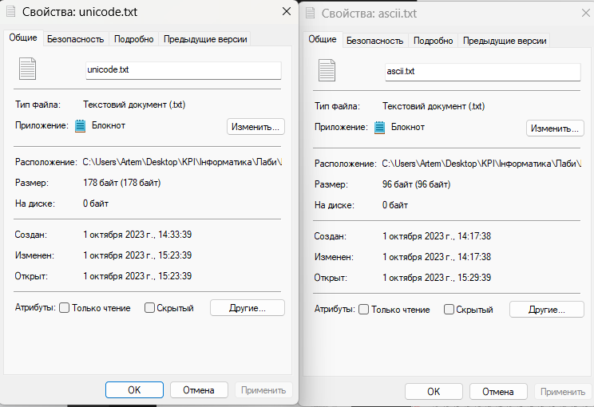

# Навігація по документу
- [Титулка](#титулка)
- [Вправа 1](#вправа-1-розширена-8-бiт-кодова-таблиця-ascii-робота-з-розширеною-кодовою-таблицею-ascii-кодова-таблиця-cp1251)
- [Вправа 2](#вправа-2-таблиця-символiв-unicode)
- [Висновок](#висновок)
- [Контрольнi питання](#контрольнi-питання)

## Титулка

<strong>МІНІСТЕРСТВО ОСВІТИ І НАУКИ УКРАЇНИ
 НАЦІОНАЛЬНИЙ ТЕХНІЧНИЙ УНІВЕРСИТЕТ УКРАЇНИ
 «КИЇВСЬКИЙ ПОЛІТЕХНІЧНИЙ ІНСТИТУТ
  ІМЕНІ ІГОРЯ СІКОРСЬКОГО»
   Навчально-науковий інститут телекомунікаційних систем
  Кафедра телекомунікацій</strong>
     Дисципліна: «Інформатика. Частина 1.»
 <strong>ПРОТОКОЛ ВИКОНАННЯ ЛАБОРАТОРНОЇ РОБОТИ № 3</strong> 
 «Лабораторна робота 3. Використання
кодових таблиць для представлення
символiв i знакiв у ПК.»

   
Виконали студенти групи 
 ЦС-31 Бригада № 8:
 - Шваліковський Вадим
 - Шилан Владислав
 - Шумлянський Артем
  Перевірила: 
 асистент кафедри ТК 
 Олена ФУРТАТ

   
<strong>КИЇВ 2023</strong>

## Вправа 1: Розширена (8-бiт) кодова таблиця ASCII. Робота з розширеною кодовою таблицею ASCII. Кодова таблиця (cp1251).
**Завдання 1**

**Завдання 2**

[_Прізвища.png)](ascii.txt) 
## Вправа 2: Таблиця символiв Unicode
**Завдання 1**

**Завдання 2**

 
## Висновок

Розмір [unicode.txt](unicode.txt) більший ніж [ascii.txt](ascii.txt), тому що кодування Unicode використовує одразу два біти.
## Контрольнi питання
**1.Призначеня кодових таблиць символiв?**

Кодові таблиці використовуються для того, щоб опрацьовувати текстові дані, які кодуються числами.

**2.Кодова таблиця ASCII?**

Кодова таблиця ASCII - система кодів, у якій числа від 0 до 127 включно поставлені у відповідність літерам, цифрам і символам.

**3.Кодова таблиця CP1251?**

Кодова таблиця CP1251 - кодування символів, що є стандартним 8-бітовим кодуванням для всіх версій Microsoft Windows.

**4.Формати символiв в Unicode.**

У Unicode існує кілька різних форматів представлення символів, а саме:

- UTF-8 (Unicode Transformation Format 8-bit): UTF-8 є засобом збереження Unicode-символів у вигляді байтів.  Використовується зазвичай у веб-розробці та в багатьох операційних системах.   Є динамічним кодуванням, що означає, що розмір символу може змінюватися від 1 до 4 байтів, залежно від коду символу.

- UTF-16 (Unicode Transformation Format 16-bit):  UTF-16 зберігає Unicode-символи у вигляді 16-бітних цілих чисел (два байти). Часто використовується в програмуванні й в операційних системах.

- UTF-32 (Unicode Transformation Format 32-bit):   UTF-32 представляє кожен символ Unicode у вигляді 32-бітного цілого числа (чотири байти).   Це найбільш простий формат, але він вимагає більше місця для зберігання тексту.

**5-6.Що означає порядок байтiв Big-endian? Продемонструвати на прикладi.Що означає порядок байтiв Little-endian? Продемонструвати на прикладi.**

Big-endian і Little-endian - це два різних порядки байтів, які використовуються для зберігання багатобайтових чисел у пам'яті комп'ютера. Вони впливають на те, в якому порядку байти представлені у пам'яті, коли велике число розбивається на окремі байти.

У Big-endian порядок байтів, найбільш значущий байт (старший байт) знаходиться в початку числа, а менш значущі байти (молодші байти) слідують за ним. Це означає, що найважливіші біти числа розташовані у початку пам'яті.

Приклад числа 0x12345678 (це число складається з чотирьох байтів):

У Big-endian порядку байтів воно зберігається так:

0x12 0x34 0x56 0x78

У Little-endian порядку байтів це ж число зберігається так:

0x78 0x56 0x34 0x12

**7.Призначення hex-редактора HxD. Продемонструвати на прикладах кодування символiв у форматi Unicode.**

Призначення hex-редактора HxD: редагування даних, які представлені в «сирому вигляді» - як послідовність байтів.

**8.Призначення програми Windows Таблиця символiв. Продемонструвати основнi функцiї.**

Призначення програми Windows Таблиця символiв: за допомогою цієї програми можна копіювати окремі символи або групи символів до буфера обміну, а потім вставляти їх у програми, які підтримують їх відтворення, а також за допомогою неї можна дізнатися коди цих символів у різних форматах кодування.

